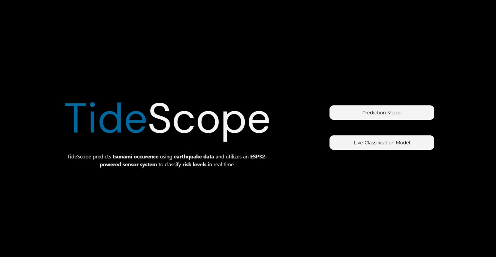
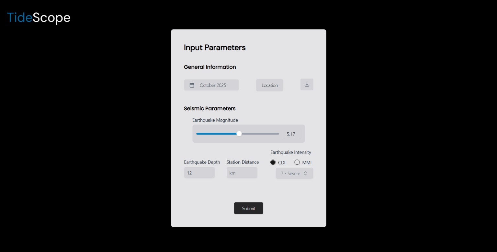
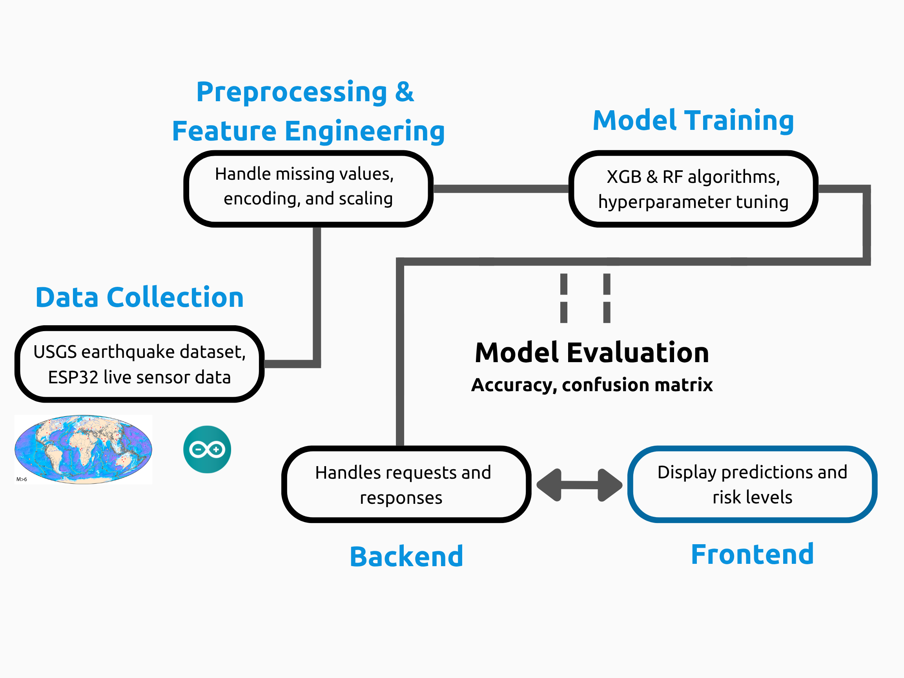

# TideScope
> AI-Powered Tsunami Prediction & Classification

<details>
<summary>Contents</summary>

- [overview](#overview)
- [architecture](#architecture)
  - [machine learning](#machine-learning)
  - [hardware](#hardware)
  - [web interface](#web-interface)
- [prerequisites / installation](#prerequisites--installation)
- [contact](#contact)

</details>

# Overview

I built **TideScope** to predict tsunami occurrence from earthquake data and classify tsunami severity in real time using an ESP32-powered sensor platform (simulation). The web interface allows live monitoring and prediction visualization. This project was presented at the 2025 Toronto Science Fair.

The system combines:

- Ensemble machine learning models (Random Forest, XGBoost) for tsunami prediction  
- Real-time severity classification (0–4 scale) using ultrasonic and accelerometer sensors on ESP32  
- React + Flask web interface for input, visualization, and live classification  

<table width="100%" cellspacing="0" cellpadding="0">
  <tr>
    <td width="50%">
      
    </td>
    <td width="50%">
      
    </td>
  </tr>
</table>

## Architecture

<div align="center">

</div>

<br>

The system is modular:

<details>
<summary>Machine Learning</summary>

- **Algorithms:** Random Forest, XGBoost for tsunami occurrence; Random Forest for severity classification  
- **Input Features:** Magnitude, depth, location, seismic intensity, sensor data (ultrasonic, accelerometer)  
- **Outputs:**  
  - Binary tsunami prediction (0 = no tsunami, 1 = tsunami)  
  - Severity classification (0–4 scale) from sensor input  
- **Accuracy:** Up to 96%  

</details>

<details>
<summary>Hardware</summary>

- **Microcontroller:** ESP32 Devkit  
- **Sensors:** Ultrasonic distance sensor, MPU6050 accelerometer  
- **Function:** Classifies simulated tsunami severity (0–4) in real time  
- **Power & Connectivity:** USB powered, communicates with Flask backend over WiFi  


</details>

<details>
<summary>Web Interface</summary>

- **Frontend:** React.js  
- **Backend:** Flask  
- **Features:**  
  - Live tsunami classification from sensor data  
  - Input form for earthquake parameters (magnitude, depth, location)  
  - Prediction visualization and confidence display  
- **Communication:** Frontend requests predictions via REST API; backend handles sensor streaming from ESP32  
</details>

## Installation
1. Clone the repository:

```bash
git clone https://github.com/jeevan9s/tidescope.git
cd tidescope
```

2. Install requirements:
   
 ```bash
 pip install -r requirements.txt
```

3. Run & Tinker
 ```bash
npm run dev

cd flask
python app.py
```
